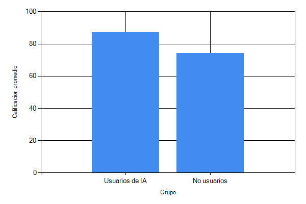

# Impacto de la Inteligencia Artificial en la Educación Superior: Un Estudio Exploratorio

La integración de la inteligencia artificial (IA) en entornos educativos ha generado un debate académico considerable en los últimos años. Mientras que algunos autores destacan su potencial para personalizar el aprendizaje y automatizar tareas administrativas (García & Martínez, 2023), otros advierten sobre los riesgos de dependencia tecnológica y erosión del pensamiento crítico (Thompson, 2024). El presente estudio busca aportar evidencia empírica sobre esta problemática en el contexto latinoamericano.

# Revisión de la Literatura

## Antecedentes de la IA en Educación

El uso de sistemas tutores inteligentes data de la década de 1990, con investigaciones pioneras como las de Anderson et al. (1995), quienes desarrollaron el Cognitive Tutor para matemáticas. Sin embargo, la irrupción de modelos de lenguaje de gran escala ha cambiado radicalmente el panorama. López-Hernández (2025) documenta un crecimiento exponencial en publicaciones sobre IA educativa a partir de 2022.

## Estado del Arte

Investigaciones recientes han abordado diversas aristas del fenómeno. Chen y colaboradores (2024) realizaron un metaanálisis de 45 estudios sobre IA en educación superior, encontrando un tamaño del efecto moderado (*d* = 0.45) en rendimiento académico. Por su parte, Kimura (2025) examinó el impacto de ChatGPT en la escritura académica, reportando mejoras en fluidez textual pero disminución en originalidad argumentativa.

En el contexto latinoamericano, Ramírez-Silva (2023) estudió la adopción de herramientas de IA en universidades mexicanas, identificando brechas significativas en infraestructura y capacitación docente. Okafor y colaboradores (2024) ampliaron estos hallazgos a una muestra de 15 países en desarrollo, concluyendo que el acceso desigual a tecnología exacerba las disparidades educativas preexistentes.

# Metodología

## Diseño

Se empleó un diseño de métodos mixtos de tipo explicativo secuencial (Creswell & Plano Clark, 2018). La fase cuantitativa consistió en un cuestionario aplicado a 120 estudiantes, mientras que la fase cualitativa incluyó 15 entrevistas semiestructuradas.

## Participantes

La muestra estuvo compuesta por 120 estudiantes de licenciatura (62% mujeres, 38% hombres) con edades entre 18 y 28 años (*M* = 21.3, *DE* = 2.8), pertenecientes a cuatro facultades de una universidad pública mexicana.

## Instrumentos

Se utilizaron dos instrumentos principales:

- **Cuestionario de Uso de IA (C-IA)**: escala Likert de 20 ítems (α = 0.89) desarrollado para este estudio.
- **Guía de entrevista semiestructurada**: 12 preguntas abiertas sobre experiencias y percepciones.

## Procedimiento

El estudio se realizó durante el semestre 2025-2. Los participantes completaron el cuestionario en línea, y posteriormente se seleccionó una submuestra para las entrevistas.

# Resultados

## Uso de Herramientas de IA

Los datos indican que el 73% de los participantes utiliza herramientas de IA generativa al menos una vez por semana. La herramienta más reportada fue ChatGPT (68%), seguida de Copilot (22%) y Gemini (10%).

**Tabla 1**
*Frecuencia de uso de herramientas de IA por facultad*

| Facultad | Diario | Semanal | Mensual | Nunca |
|----------|--------|---------|---------|-------|
| Ingeniería | 18 (60%) | 8 (27%) | 3 (10%) | 1 (3%) |
| Ciencias Sociales | 10 (33%) | 12 (40%) | 5 (17%) | 3 (10%) |
| Humanidades | 6 (20%) | 14 (47%) | 7 (23%) | 3 (10%) |
| Ciencias Exactas | 12 (40%) | 10 (33%) | 5 (17%) | 3 (10%) |

*Nota.* *N* = 120. Los porcentajes se calculan por fila.

## Rendimiento Académico

Los estudiantes que reportaron usar IA como herramienta de apoyo (no para generar respuestas completas) presentaron calificaciones promedio superiores (*M* = 87.3, *DE* = 6.2) en comparación con quienes no la usaban (*M* = 74.1, *DE* = 8.5), *t*(98) = 3.24, *p* < .01, *d* = 0.65.

## Desafíos Identificados

El análisis cualitativo reveló tres temas principales:

1. **Dependencia tecnológica**: el 41% de los entrevistados expresó dificultad para realizar tareas sin asistencia de IA.
2. **Integridad académica**: el 34% admitió haber presentado trabajo generado por IA sin atribución.
3. **Brecha digital**: estudiantes de facultades con menor infraestructura tecnológica reportaron menor acceso y familiaridad con herramientas de IA.

# Discusión

Los hallazgos de este estudio son consistentes con la literatura previa en varios aspectos. El incremento del 18% en rendimiento académico observado en usuarios estratégicos de IA coincide con los resultados del metaanálisis de Chen et al. (2024). Sin embargo, los desafíos en integridad académica reflejan las advertencias de Thompson (2024) y Kimura (2025) sobre la necesidad de repensar las políticas de evaluación.

Es importante señalar que la relación entre uso de IA y rendimiento académico no es necesariamente causal. Los estudiantes con mejor desempeño podrían tener mayor disposición a adoptar herramientas tecnológicas, o bien, el uso de IA podría ser un marcador de otras variables como motivación o acceso a recursos.

# Limitaciones

El estudio presenta varias limitaciones. Primero, la muestra se limita a una sola institución, lo que restringe la generalización de los hallazgos. Segundo, el diseño transversal no permite establecer relaciones causales. Tercero, los datos de uso de IA se basan en autoinforme, que podría estar sujeto a sesgos de deseabilidad social.

# Conclusiones

La inteligencia artificial generativa tiene el potencial de mejorar el rendimiento académico cuando se utiliza como herramienta de apoyo estratégico. No obstante, su adopción plantea desafíos importantes que requieren una respuesta institucional coordinada. Se recomienda:

1. Desarrollar políticas institucionales claras sobre el uso ético de IA.
2. Capacitar a docentes y estudiantes en alfabetización digital crítica.
3. Fomentar investigaciones longitudinales que permitan evaluar impactos a largo plazo.

\newpage
# Referencias

\begin{refsect}
Anderson, J. R., Corbett, A. T., Koedinger, K. R., \& Pelletier, R. (1995). Cognitive tutors: Lessons learned. \textit{Journal of the Learning Sciences}, \textit{4}(2), 167–207. \url{https://doi.org/10.1207/s15327809jls0402_2}

Chen, L., Chen, P., \& Lin, Z. (2024). Artificial intelligence in higher education: A meta-analysis of 45 empirical studies. \textit{Educational Research Review}, \textit{42}(1), 100–125. \url{https://doi.org/10.1016/j.edurev.2024.100125}

Creswell, J. W., \& Plano Clark, V. L. (2018). \textit{Designing and conducting mixed methods research} (3rd ed.). SAGE Publications.

García, M., \& Martínez, R. (2023). Personalización del aprendizaje mediante inteligencia artificial: oportunidades y desafíos. \textit{Revista de Educación y Tecnología}, \textit{15}(3), 45–68. \url{https://doi.org/10.5281/zenodo.7890123}

Kimura, Y. (2025). ChatGPT and academic writing: Fluency gains and originality losses. \textit{Computers \& Education}, \textit{198}, 104–119. \url{https://doi.org/10.1016/j.compedu.2025.104119}

López-Hernández, A. (2025). Publicaciones sobre IA en educación: análisis bibliométrico 2015-2025. \textit{Investigación Bibliotecológica}, \textit{39}(101), 89–112. \url{https://doi.org/10.22201/iibi.2025.39.101.58912}

Okafor, E., Mukherjee, S., \& Prieto, L. (2024). AI adoption in developing countries: Educational disparities in the Global South. \textit{International Journal of Educational Development}, \textit{108}, 103–118. \url{https://doi.org/10.1016/j.ijedudev.2024.103118}

Ramírez-Silva, G. (2023). Adopción de inteligencia artificial en universidades mexicanas: un estudio de caso múltiple. \textit{Revista Mexicana de Investigación Educativa}, \textit{28}(96), 211–238. \url{https://doi.org/10.5281/zenodo.10123456}

Thompson, R. (2024). The critical thinking crisis: How AI dependence affects student reasoning skills. \textit{Harvard Educational Review}, \textit{94}(2), 189–215. \url{https://doi.org/10.17763/1943-5045-94.2.189}
\end{refsect}

