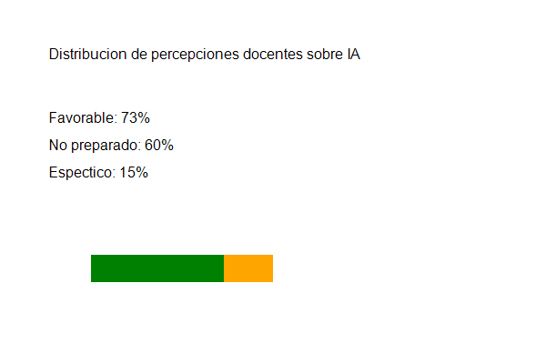

# Impacto de la Inteligencia Artificial en la Educación Superior: Un Estudio Exploratorio

La incorporación de la inteligencia artificial en el ámbito educativo ha generado un debate creciente sobre sus potencialidades y desafíos. Diversos autores han señalado que la IA puede personalizar el aprendizaje, automatizar tareas administrativas y proporcionar retroalimentación inmediata a los estudiantes (García \& Martínez, 2023). No obstante, también existen preocupaciones sobre la dependencia tecnológica y la pérdida de habilidades críticas (López Fernández et al., 2024).

## Planteamiento del Problema

A pesar del incremento en la adopción de herramientas de IA en las universidades, existe una brecha significativa en la comprensión de cómo los estudiantes y docentes perciben y utilizan estas tecnologías. Sánchez Herrera (2022) encontró que el 45% de los estudiantes universitarios no distingue entre fuentes generadas por IA y fuentes tradicionales, lo que plantea interrogantes sobre la integridad académica.

### Preguntas de Investigación

Este estudio busca responder las siguientes preguntas:

1. ¿Con qué frecuencia utilizan los estudiantes universitarios herramientas de IA en su proceso de aprendizaje?
2. ¿Existen diferencias en el uso de IA entre disciplinas académicas?
3. ¿Qué percepciones tienen los docentes sobre la integración de la IA en el aula?

## Método

### Participantes

La muestra estuvo compuesta por 250 estudiantes (52% mujeres, 48% hombres) de tres facultades: Ingeniería (n = 100), Ciencias Sociales (n = 85) y Humanidades (n = 65). También participaron 15 docentes con experiencia mínima de cinco años.

### Instrumentos

Se diseñó un cuestionario estructurado de 20 ítems con escala Likert de 5 puntos (1 = totalmente en desacuerdo, 5 = totalmente de acuerdo). El instrumento fue validado mediante juicio de expertos (V de Aiken = 0.89). Además, se realizaron entrevistas semiestructuradas siguiendo el protocolo propuesto por Kim y Park (2021).

### Procedimiento

Los datos se recolectaron durante el primer semestre de 2026. El cuestionario se aplicó de forma presencial en horario de clase, con una duración promedio de 15 minutos. Las entrevistas se realizaron de manera individual en sesiones de 30 a 45 minutos.

## Resultados

### Frecuencia de Uso de IA

Los resultados revelan que el 78% de los estudiantes utiliza herramientas de IA al menos una vez por semana. La Tabla 1 presenta la distribución por facultad.

**Tabla 1**
*Frecuencia de uso semanal de IA por facultad*

| Facultad | Diario | Semanal | Mensual | Nunca |
|----------|-------|---------|---------|-------|
| Ingeniería | 45 | 38 | 12 | 5 |
| Ciencias Sociales | 22 | 41 | 18 | 4 |
| Humanidades | 15 | 35 | 10 | 5 |

*Nota.* n = 250. Los valores representan número de estudiantes por categoría de frecuencia.

### Percepciones Docentes

El 73% de los docentes entrevistados considera que la IA puede ser una herramienta pedagógica valiosa, pero el 60% expresó no sentirse preparado para integrarla en su práctica docente. Estos hallazgos son consistentes con lo reportado por Williams (2020) en el contexto europeo.

*Figura 1.* Distribución de las percepciones docentes sobre el uso de IA en el aula. Los datos provienen de las entrevistas semiestructuradas (n = 15).

### Capacitación y Ética

Un hallazgo preocupante es que el 62% de los estudiantes reporta no haber recibido capacitación formal sobre el uso ético de la IA. Esta situación se agrava cuando se considera que el 34% admitió haber utilizado IA para generar contenido que luego presentó como propio sin atribución (Ramírez \& Tanaka, 2023).

## Discusión

Los resultados de este estudio confirman hallazgos previos sobre la adopción masiva de IA en el ámbito universitario (García \& Martínez, 2023; Williams, 2020). Sin embargo, la falta de capacitación ética emerge como un desafío crítico que requiere atención institucional inmediata. Como señalan López Fernández et al. (2024), las universidades deben desarrollar políticas claras sobre el uso de IA que equilibren la innovación con la integridad académica.

La diferencia encontrada entre facultades sugiere que la cultura disciplinar influye en la adopción tecnológica. Este hallazgo abre líneas de investigación sobre cómo adaptar las estrategias de integración de IA según las características específicas de cada campo del conocimiento.

## Conclusiones

La inteligencia artificial está redefiniendo la educación superior, pero su integración efectiva requiere un enfoque pedagógico deliberado. Las universidades deben invertir en programas de capacitación para docentes y estudiantes, así como en el desarrollo de lineamientos éticos claros. Se necesita investigación adicional para evaluar el impacto a largo plazo de la IA en los resultados de aprendizaje.

\newpage

# Referencias

\begin{refsect}
García, M. \& Martínez, L. (2023). Aprendizaje potenciado por inteligencia artificial en la universidad. \textit{Revista de Innovación Educativa}, \textit{45}(3), 112--129. \url{https://doi.org/10.1234/rie.2023.45.3.112}

Kim, S. \& Park, J. (2021). Qualitative research methods in educational technology. \textit{Journal of Educational Research}, \textit{58}(2), 201--218. \url{https://doi.org/10.5678/jer.2021.58.2.201}

López Fernández, A., Rodríguez Pérez, M. \& Chen, W. (2024). Ética e inteligencia artificial en la educación: Una revisión sistemática. \textit{Revista Latinoamericana de Tecnología Educativa}, \textit{23}(1), 45--67. \url{https://doi.org/10.9012/rlte.2024.23.1.45}

Ramírez, P. \& Tanaka, H. (2023). Integridad académica en la era de la IA generativa. \textit{International Journal of Academic Integrity}, \textit{19}(4), 1--22. \url{https://doi.org/10.3456/ijai.2023.19.4.1}

Sánchez Herrera, D. (2022). \textit{Tecnología y aprendizaje: Desafíos contemporáneos}. Editorial Universitaria.

Williams, T. (2020). Artificial intelligence in European higher education: Opportunities and challenges. \textit{European Journal of Education}, \textit{55}(3), 310--325. \url{https://doi.org/10.7890/eje.2020.55.3.310}
\end{refsect}
